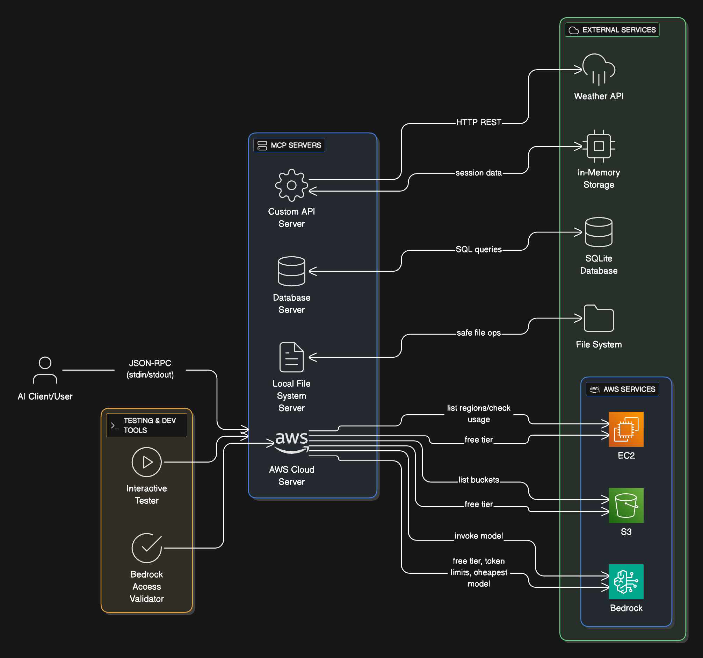

# MCP Learning Project 🚀

> A comprehensive, cost-optimized exploration of Model Context Protocol (MCP) capabilities for local development and AWS integration.

[](https://aws.amazon.com/bedrock/)
[](https://python.org)
[](docs/cost-optimization.md)
[](LICENSE)

## Architecture Overview



## What is MCP?

Model Context Protocol (MCP) is an open standard that enables AI assistants to securely connect to external data sources and tools. Think of it as a universal adapter that lets AI models interact with your files, databases, APIs, and cloud services.

## 🎯 What You'll Learn

- **MCP Protocol Fundamentals** - Tools, resources, and JSON-RPC communication
- **Local Development** - File system operations, database queries, custom APIs
- **AWS Integration** - Bedrock AI models, S3, cost-optimized cloud services
- **Real-World Applications** - Weather APIs, SQL databases, AI inference
- **Cost Management** - Free tier optimization, billing monitoring

## 📁 Project Structure

```
MCP/
├── aws-mcp/                 # AWS integration (Bedrock, S3, regions)
│   └── aws-server.py         # Cost-optimized AWS MCP server
├── database-mcp/             # SQLite database operations
│   ├── sqlite-server.py      # Database MCP server
│   └── learning.db           # Sample database with users/projects
├── custom-mcp/               # Custom server templates
│   └── template-server.py    # Weather API, storage, timestamps
├── local-mcp/                # File system operations
│   └── filesystem-server.py  # Safe local file access
├── docs/                     # Documentation and guides
│   ├── cost-optimization.md  # AWS cost management
│   ├── getting-started.md    # Setup instructions
│   └── what-you-learned.md   # Learning summary
├── test-mcp.py              # Interactive server tester
├── check-bedrock-access.py  # Bedrock access validator
├── requirements.txt         # Python dependencies
└── README.md               # This file
```

## 🚀 Quick Start

### 1. Install Dependencies
```bash
git clone <your-repo>
cd MCP
pip install -r requirements.txt
```

### 2. Test Local Servers (No AWS Required)
```bash
# Test database operations
echo '{"method": "tools/list"}' | python3 database-mcp/sqlite-server.py

# Test weather API
echo '{"method": "tools/call", "params": {"name": "get_weather", "arguments": {"city": "San Francisco"}}}' | python3 custom-mcp/template-server.py

# Interactive testing
python3 test-mcp.py
```

### 3. AWS Setup (Optional)
```bash
# Install AWS CLI
brew install awscli  # macOS
# or: pip install awscli

# Configure credentials
aws configure
# Enter: Access Key, Secret Key, us-west-2, json

# Request Bedrock model access (AWS Console)
# Go to: AWS Console → Bedrock → Model access
# Request: Amazon Titan Text G1 - Lite

# Test AWS integration
python3 check-bedrock-access.py
```

## 🛠️ Available MCP Servers

### 1. AWS MCP Server (`aws-mcp/aws-server.py`)
**Cost-optimized AWS integration**
- ✅ **Bedrock AI Models** - Titan Text Lite (~$0.0003/1K tokens)
- ✅ **S3 Operations** - List buckets, manage storage
- ✅ **Region Discovery** - List all AWS regions
- ✅ **Usage Tracking** - Monitor free tier consumption

```bash
# Test Bedrock AI
echo '{"method": "tools/call", "params": {"name": "invoke_bedrock_model", "arguments": {"prompt": "Hello MCP!", "max_tokens": 50}}}' | python3 aws-mcp/aws-server.py
```

### 2. Database MCP Server (`database-mcp/sqlite-server.py`)
**SQLite database with sample data**
- ✅ **SQL Query Execution** - Safe parameterized queries
- ✅ **Schema Inspection** - Explore table structures
- ✅ **Sample Data** - Users and projects tables included

```bash
# Query sample data
echo '{"method": "tools/call", "params": {"name": "execute_query", "arguments": {"query": "SELECT * FROM users"}}}' | python3 database-mcp/sqlite-server.py
```

### 3. Custom MCP Server (`custom-mcp/template-server.py`)
**Template for building your own servers**
- ✅ **Weather API Integration** - Real-time weather data
- ✅ **Key-Value Storage** - In-memory data persistence
- ✅ **Timestamp Generation** - Multiple time formats
- ✅ **Extensible Design** - Easy to add new tools

```bash
# Get weather data
echo '{"method": "tools/call", "params": {"name": "get_weather", "arguments": {"city": "Portland"}}}' | python3 custom-mcp/template-server.py
```

### 4. File System MCP Server (`local-mcp/filesystem-server.py`)
**Safe local file operations**
- ✅ **File Read/Write** - Restricted to project directory
- ✅ **Directory Listing** - Explore folder contents
- ✅ **Path Validation** - Security-first design

```bash
# List project files
echo '{"method": "tools/call", "params": {"name": "list_directory", "arguments": {"path": "/Users/karl/MCP"}}}' | python3 local-mcp/filesystem-server.py
```

## 💰 Cost Optimization

### Free Tier Services Used
- **SQLite** - No database hosting costs
- **Local Development** - No cloud charges
- **AWS Free Tier** - 750 hours EC2, 5GB S3, 1M Lambda requests
- **Bedrock Titan Text Lite** - Cheapest AI model available

### Typical Monthly Costs
- **Learning/Development**: <$1/month
- **Production Experimentation**: $5-10/month
- **Enterprise Usage**: Scales with actual usage

### Cost Monitoring
```bash
# Check AWS costs
aws ce get-cost-and-usage --time-period Start=2024-01-01,End=2024-01-31 --granularity MONTHLY --metrics BlendedCost

# Set billing alerts in AWS Console
# Recommended: $5, $10, $25 thresholds
```

## 🧪 Testing & Development

### Interactive Testing
```bash
# Launch interactive tester
python3 test-mcp.py
# Select server → Select tool → Enter parameters
```

### Manual Testing
```bash
# List available tools
echo '{"method": "tools/list"}' | python3 <server-path>

# Call specific tool
echo '{"method": "tools/call", "params": {"name": "tool_name", "arguments": {"param": "value"}}}' | python3 <server-path>
```

### Sample Queries
```bash
# Database: Get project statistics
echo '{"method": "tools/call", "params": {"name": "execute_query", "arguments": {"query": "SELECT status, COUNT(*) as count FROM projects GROUP BY status"}}}' | python3 database-mcp/sqlite-server.py

# AWS: List regions in JSON format
echo '{"method": "tools/call", "params": {"name": "get_aws_regions", "arguments": {}}}' | python3 aws-mcp/aws-server.py

# Custom: Store and retrieve data
echo '{"method": "tools/call", "params": {"name": "store_data", "arguments": {"key": "learning", "value": "MCP is awesome!"}}}' | python3 custom-mcp/template-server.py
```

## 🔧 Advanced Usage

### Building Custom MCP Servers
1. Copy `custom-mcp/template-server.py`
2. Add your tools to the `tools/list` response
3. Implement tool logic in `tools/call` handler
4. Test with `test-mcp.py`

### Integration with AI Clients
- **Claude Desktop**: Add server configs to `claude_desktop_config.json`
- **Custom Clients**: Use MCP SDK or direct JSON-RPC
- **API Gateways**: Wrap servers in REST/GraphQL endpoints

### Production Considerations
- **Authentication**: Add API keys, OAuth, or IAM roles
- **Logging**: Implement structured logging and monitoring
- **Error Handling**: Graceful degradation and retry logic
- **Rate Limiting**: Protect against abuse and cost overruns

## 📚 Learning Resources

### Documentation
- [`docs/getting-started.md`](docs/getting-started.md) - Detailed setup guide
- [`docs/cost-optimization.md`](docs/cost-optimization.md) - AWS cost management
- [`docs/what-you-learned.md`](docs/what-you-learned.md) - Learning outcomes
- [`NEXT-STEPS.md`](NEXT-STEPS.md) - Advanced project ideas

### External Resources
- [MCP Specification](https://spec.modelcontextprotocol.io/) - Official protocol docs
- [AWS Bedrock Pricing](https://aws.amazon.com/bedrock/pricing/) - Model costs
- [Claude Desktop MCP](https://docs.anthropic.com/claude/docs/mcp) - Client integration

## 🤝 Contributing

1. Fork the repository
2. Create a feature branch: `git checkout -b feature/amazing-mcp-server`
3. Add your MCP server to the appropriate directory
4. Update documentation and tests
5. Submit a pull request

### Ideas for Contributions
- **New MCP Servers**: GitHub integration, Slack bot, IoT devices
- **Cost Optimizations**: Better free tier usage, cheaper models
- **Documentation**: Tutorials, examples, troubleshooting guides
- **Testing**: Automated tests, performance benchmarks

## 🐛 Troubleshooting

### Common Issues

**"No credentials" error**
```bash
aws configure
# Enter your AWS credentials
```

**"Permission denied" error**
```bash
chmod +x *.py
# Check file permissions
```

**"Module not found" error**
```bash
pip install -r requirements.txt
# Install dependencies
```

**High AWS costs**
- Check AWS Billing Dashboard
- Review CloudTrail for unexpected API calls
- Set up billing alerts
- Use `check_free_tier_usage` tool

### Getting Help
- Check [`docs/`](docs/) directory for detailed guides
- Review error messages in server output
- Test with minimal examples first
- Monitor AWS costs regularly

## 📄 License

MIT License - see [LICENSE](LICENSE) file for details.

## 🎉 Success Stories

> "Built my first MCP server in 30 minutes and connected it to Claude Desktop. Game changer for my workflow!" - Developer

> "The cost optimization guide saved me from a $200 AWS bill. Perfect for learning without breaking the bank." - Student

> "Used this as a foundation to build MCP servers for our entire development team." - Engineering Manager

---

**Ready to explore MCP?** Start with `python3 test-mcp.py` and dive into the future of AI integration! 🚀